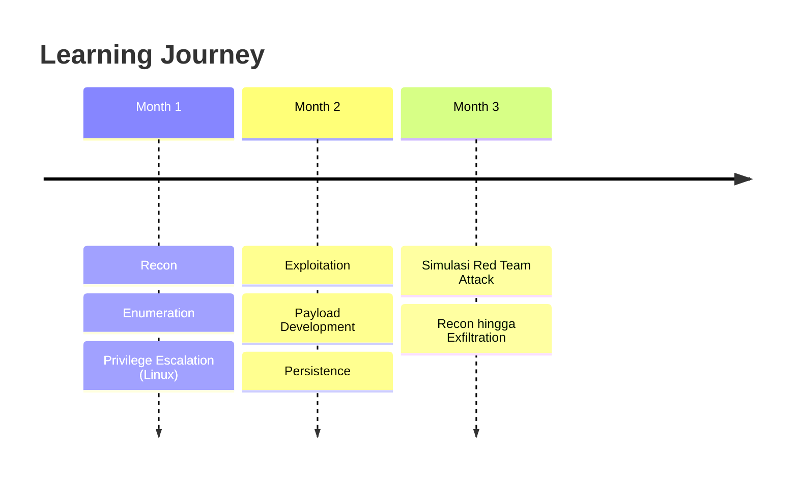

# 🚩 Offensive Security Lab

<div align="center">


</div>

---

## 🔥 Personal Red Teaming & Exploitation Journey

Repository ini berisi dokumentasi perjalanan saya dalam mempelajari **Red Teaming** dan **Exploitation**.  
Fokus utama adalah membangun kemampuan ofensif secara sistematis: dari **reconnaissance**, **exploitation**, **privilege escalation**, hingga **persistence**.

---

## 🎯 Tujuan

> *Membangun kemampuan Red Teaming yang solid dan terstruktur*

- ⚔️ **Membangun mindset ofensif** layaknya Red Teamer
- 🛠️ **Menguasai tools dasar** (nmap, netcat, metasploit, enum4linux, dll)
- 🎪 **Melakukan simulasi serangan** dari awal hingga akhir
- 📝 **Menyusun dokumentasi** yang rapi sebagai portofolio profesional

---

## 📂 Struktur Repo

```
🏛️ Offensive_Security_Lab/
│
├── � resources/                   # Referensi tambahan
│    ├── 📖 books.md               
│    ├── 📋 cheatsheets.md         
│    └── 🔗 links.md                
│
├── �️ tools-notes/                 # Catatan singkat per tool
│   ├── 🗺️ nmap.md                 
│   ├── 🔌 netcat.md               
│   ├── ⚔️ metasploit.md           
│   └── 🦈 wireshark.md            
│
├── 📅 week1-recon/                # 🔍 Week 1: Recon & Network Awareness
│   └── 📋 report.md
├── 📅 week2-metasploit/           # ⚔️ Week 2: 
│   └── 📋 report.md
├── 📅 week3-enumeration/          # 🔎 Week 3: 
│   └── 📋 report.md
├── 📅 week4-privesc/              # 🚀 Week 4: 
│   └── 📋 report.md
│
└── � README.md                    # Deskripsi utama repository
  
```

---

## 🛠️ Tools Utama

<table>
<tr>
<td align="center">
<br/>
<b>Kali Linux</b>
</td>
<td align="center">
<br/>
<b>Metasploitable 2 (Target Lab)</b>
</td>
</tr>
<tr>
<td align="center">
<br/>
<b>Nmap, Netcat, Wireshark</b>
</td>
<td align="center">
<br/>
<b>Metasploit Framework</b>
</td>
</tr>
<tr>
<td align="center" colspan="2">
<br/>
<b>Enum4linux, LinPEAS, GTFOBins</b>
</td>
</tr>
</table>

---

## 🚀 Roadmap 3 Bulan

<div align="center">



</div>

| 📅 **Periode** | 🎯 **Focus Area** | 📋 **Detail** |
|---|---|---|
| **Month 1** | 🔍 **Foundation** | Recon, Enumeration, Privilege Escalation (Linux) |
| **Month 2** | ⚔️ **Exploitation** | Exploitation, Payload Development, Persistence |
| **Month 3** | 🎪 **Simulation** | Simulasi Red Team Attack dari Recon hingga Exfiltration |

---

## ⚖️ Disclaimer

<div align="center">

> ⚠️ **PENTING - ETHICAL USE ONLY** ⚠️

</div>

Semua aktivitas di repo ini dilakukan di **lingkungan lab pribadi** dengan tujuan **edukasi**.  
Saya **tidak bertanggung jawab** atas penyalahgunaan pengetahuan ini di luar konteks **etis dan legal**.

---

<div align="center">

**🔥 Happy Hacking! 🔥**

*Educational purposes only - Practice responsibly*

</div>
